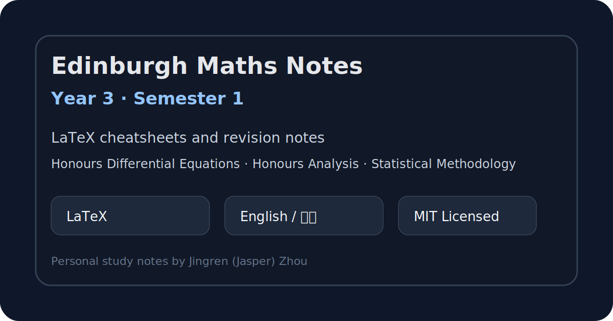

# Edinburgh Maths Year 3 Notes – Semester 1



A curated collection of my personal **LaTeX revision notes and cheatsheets** for **Year 3 Mathematics, Semester 1** at the **University of Edinburgh**.

The notes are written primarily for my own revision, but I am making them public in case they are useful to other students reviewing similar material.

## Courses included

| Course | Folder | Notes |
|---|---:|---|
| Honours Differential Equations | `HDE/Note/` | Differential equations, solution methods, qualitative ideas, and revision summaries |
| Honours Analysis | `HAna/Note/` | Core definitions, theorems, proof ideas, and analysis revision material |
| Statistical Methodology | `SMe/Note/` | Statistical modelling, methodology summaries, and formula-based revision |

## Repository structure

```text
.
├── HAna/Note/      # Honours Analysis notes
├── HDE/Note/       # Honours Differential Equations notes
├── SMe/Note/       # Statistical Methodology notes
├── assets/         # README images and preview assets
├── .gitignore      # LaTeX/editor build artefact exclusions
├── LICENSE         # MIT License
└── README.md
```

## Features

- Written in **LaTeX**
- Bilingual notes: **English and Chinese** where helpful
- Designed for quick revision before exams
- Focuses on key definitions, theorem statements, formulas, examples, and proof sketches
- Cleaned for public release: generated LaTeX logs and local editor files are excluded

## How to use

You can either read the compiled PDFs if present, or compile the `.tex` files yourself with XeLaTeX.

```bash
xelatex "Note File.tex"
```

For documents with references or tables of contents, run XeLaTeX more than once.

## Disclaimer

These are personal study notes and may contain mistakes, omissions, or non-standard explanations. They are **not official University of Edinburgh course materials**. Please use them as supplementary revision material only.

## License

Released under the [MIT License](LICENSE). You may use, adapt, and share the notes, but please keep the copyright and license notice.
